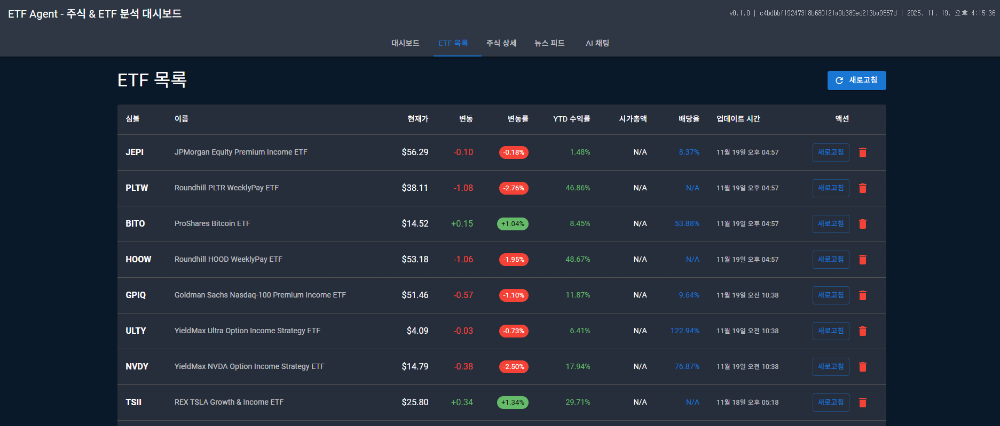
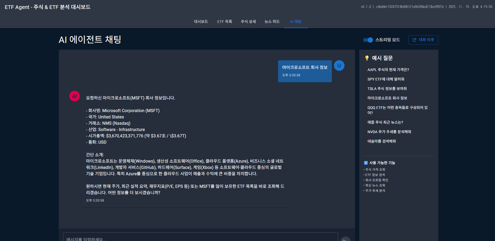
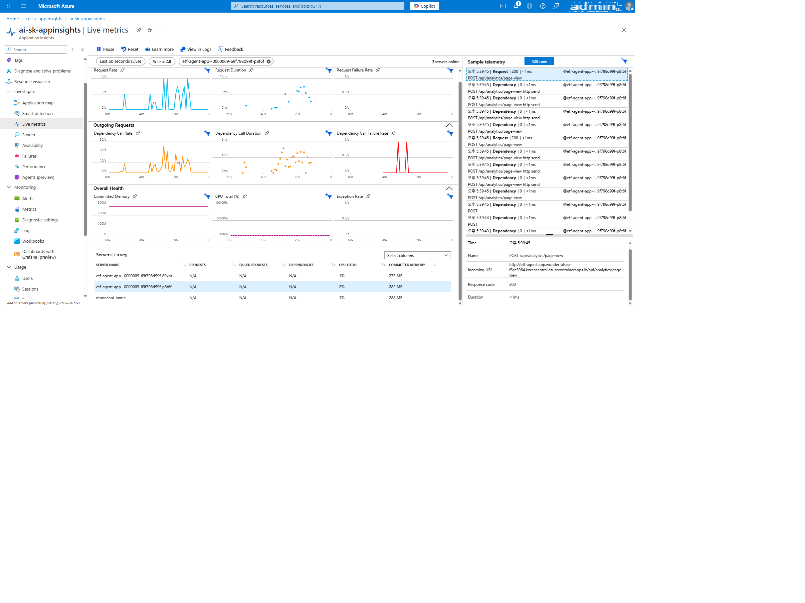

# ETF Agent

[](https://github.com/dotnetpower/sk-appinsights/actions/workflows/deploy-containerapp.yml)
[](https://github.com/dotnetpower/sk-appinsights/actions/workflows/ci.yml)
[](https://www.python.org/downloads/)
[](https://nodejs.org/)
[](https://fastapi.tiangolo.com/)
[](https://reactjs.org/)
[](LICENSE)
[](https://azure.microsoft.com/en-us/services/container-apps/)
[](https://azure.microsoft.com/en-us/services/monitor/)
[](https://azure.microsoft.com/en-us/services/cosmos-db/)

ETF 및 주식 종목 데이터 분석 에이전트 프로젝트, 주식 데이터는 실제 데이터이지만 Application Insights 의 모니터링 기능 시연을 위한 예제입니다.








[실습](https://moaw.dev/workshop/gh:dotnetpower/sk-appinsights/main/docs/?step=0)

## 프로젝트 구조

```
sk-appinsights/
├── src/                          # Backend 소스 코드
│   ├── agent/                    # Semantic Kernel 에이전트
│   │   ├── __init__.py
│   │   ├── agent_service.py      # 에이전트 서비스
│   │   └── stock_plugin.py       # 주식 데이터 플러그인
│   ├── api/                      # FastAPI 라우터
│   │   ├── __init__.py
│   │   ├── analytics.py          # 사용자 행동 분석 API
│   │   ├── chat.py               # AI 채팅 API
│   │   ├── etf.py                # ETF 데이터 API
│   │   ├── news.py               # 뉴스 API
│   │   └── stocks.py             # 주식 데이터 API
│   ├── observability/            # Application Insights 텔레메트리
│   │   ├── __init__.py
│   │   ├── middleware.py         # HTTP 요청 추적 미들웨어
│   │   ├── telemetry.py          # 텔레메트리 설정 및 추적 함수
│   │   └── utils.py              # 유틸리티 함수
│   ├── services/                 # 비즈니스 로직 서비스
│   │   ├── __init__.py
│   │   ├── alphavantage_service.py    # Alpha Vantage API
│   │   ├── cosmos_service.py          # Cosmos DB 서비스
│   │   ├── rss_news_service.py        # RSS 뉴스 서비스
│   │   ├── totalrealreturns_service.py # TotalRealReturns API
│   │   └── yfinance_service.py        # Yahoo Finance API
│   ├── __init__.py
│   ├── config.py                 # 설정 관리
│   └── main.py                   # FastAPI 서버 진입점
│
├── frontend/                     # React 대시보드
│   ├── public/                   # 정적 파일
│   │   ├── index.html
│   │   ├── manifest.json
│   │   └── robots.txt
│   ├── src/
│   │   ├── components/           # React 컴포넌트
│   │   │   ├── ChatInterface.tsx      # AI 채팅 인터페이스
│   │   │   ├── Dashboard.tsx          # 메인 대시보드
│   │   │   ├── ETFList.tsx            # ETF 목록
│   │   │   ├── NewsFeed.tsx           # 뉴스 피드
│   │   │   └── StockDetail.tsx        # 주식 상세 정보
│   │   ├── hooks/                # 커스텀 훅
│   │   │   └── usePageTracking.ts     # 페이지 추적 훅
│   │   ├── services/             # API 클라이언트
│   │   │   ├── analytics.ts           # 분석 API 클라이언트
│   │   │   └── api.ts                 # 백엔드 API 클라이언트
│   │   ├── App.tsx               # 메인 앱 컴포넌트
│   │   ├── index.tsx             # 진입점
│   │   └── setupTests.ts         # 테스트 설정
│   ├── package.json              # 프론트엔드 의존성
│   └── tsconfig.json             # TypeScript 설정
│
├── .github/                      # GitHub 설정
│   └── copilot-instructions.md   # Copilot 지침
│
├── .vscode/                      # VSCode 설정
│   ├── launch.json               # 디버그 설정
│   └── tasks.json                # 태스크 설정
│
├── 문서/                         # 프로젝트 문서
│   ├── TELEMETRY_TABLES.md       # 텔레메트리 테이블 가이드
│   ├── USER_BEHAVIOR_ANALYTICS.md # 사용자 행동 분석 가이드
│   ├── LIVE_METRICS_GUIDE.md     # Live Metrics 가이드
│   ├── DASHBOARD_SETUP.md        # Azure 대시보드 설정
│   ├── GUIDE.md                  # 개발 가이드
│   └── WSL_NETWORK_SETUP.md      # WSL 네트워크 설정
│
├── 테스트 파일/
│   ├── test_chat.py              # 채팅 API 테스트
│   ├── test_cosmos.py            # Cosmos DB 테스트
│   ├── test_fallback.py          # 폴백 로직 테스트
│   ├── test_live_metrics.py      # Live Metrics 테스트
│   ├── test_observability.py     # 텔레메트리 테스트
│   └── test_rss_news.py          # RSS 뉴스 테스트
│
├── Azure 설정 파일/
│   ├── azure-dashboard.json      # Azure Portal 대시보드
│   ├── azure-workbook.json       # Azure Workbook
│   └── *.example.json            # 설정 템플릿
│
├── .env                          # 환경변수 (실제 값, git 제외)
├── .env.example                  # 환경변수 템플릿
├── .gitignore                    # Git 제외 파일
├── pyproject.toml                # Python 프로젝트 설정 (uv)
├── uv.lock                       # 의존성 잠금 파일
├── verify.sh                     # 시스템 검증 스크립트
├── LICENSE                       # 라이선스
└── README.md                     # 프로젝트 설명서
```

## 기술 스택

### Backend
- **Python 3.13+**: 최신 Python 런타임
- **uv**: 고속 Python 패키지 관리자
- **FastAPI**: 고성능 비동기 REST API 프레임워크
- **Uvicorn**: ASGI 서버
- **Semantic Kernel 1.14+**: Microsoft AI 에이전트 프레임워크
- **주식 데이터 소스**:
  - **yfinance**: Yahoo Finance 데이터 (주요 소스)
  - **Alpha Vantage API**: 보조 데이터 소스
  - **TotalRealReturns API**: ETF 수익률 데이터
  - **RSS Feeds**: 실시간 뉴스
- **Azure Cosmos DB**: NoSQL 데이터베이스 (캐싱 및 저장)
- **Application Insights**: 애플리케이션 모니터링 및 텔레메트리
- **OpenTelemetry**: 분산 추적 및 메트릭 수집
  - `azure-monitor-opentelemetry`: Azure Monitor 통합
  - `opentelemetry-instrumentation-fastapi`: FastAPI 자동 계측
  - `opentelemetry-instrumentation-httpx`: HTTP 클라이언트 추적
- **applicationinsights SDK**: pageViews, customEvents 전송

### Frontend
- **React 18**: 사용자 인터페이스 라이브러리
- **TypeScript**: 정적 타입 JavaScript
- **Material-UI (MUI)**: UI 컴포넌트 라이브러리
- **Axios**: HTTP 클라이언트
- **사용자 행동 분석**: 페이지 뷰 추적 및 이벤트 로깅

### 주요 기능
- 📊 **ETF 종목 목록**: 실시간 ETF 데이터 조회
- 📈 **주식 상세 정보**: 개별 종목 분석 (가격, 거래량, 뉴스)
- 📰 **뉴스 피드**: RSS 기반 실시간 주식 뉴스
- 💬 **AI 채팅**: Semantic Kernel 기반 주식 질의응답
- 📉 **데이터 시각화**: 차트 및 그래프
- 🔍 **사용자 행동 분석**: Application Insights 통합

## 설치 및 실행

### 사전 요구사항

- Python 3.13 이상
- Node.js 18 이상
- uv 패키지 관리자
- Azure 계정 (Application Insights, Cosmos DB)

### 1. 프로젝트 클론 및 초기화

```bash
# 저장소 클론
git clone https://github.com/dotnetpower/sk-appinsights.git
cd sk-appinsights

# Python 가상환경 생성 및 활성화
python3 -m venv .venv
source .venv/bin/activate  # Linux/Mac
# .venv\Scripts\activate   # Windows

# Python 의존성 설치
uv sync --prerelease=allow

# Frontend 의존성 설치
cd frontend
npm install
cd ..
```

### 2. 환경변수 설정

`.env` 파일을 생성하고 필요한 값을 입력하세요:

```bash
cp .env.example .env
```

**필수 환경변수**:
```bash
# Azure Container Registry (배포용)
CONTAINER_REGISTRY_NAME=crskappinsights
RESOURCE_GROUP=rg-sk-appinsights
LOCATION=koreacentral
CONTAINER_APP_NAME=ca-sk-appinsights

# Application Insights (필수)
APPLICATIONINSIGHTS_CONNECTION_STRING="InstrumentationKey=xxx;IngestionEndpoint=https://koreacentral-0.in.applicationinsights.azure.com/;LiveEndpoint=https://koreacentral.livediagnostics.monitor.azure.com/;ApplicationId=xxx"

# Azure Cosmos DB (필수)
COSMOS_ENDPOINT="https://xxx.documents.azure.com:443/"
# Azure AD (RBAC) 인증 사용 시 - COSMOS_KEY 생략 가능
# COSMOS_KEY="your-cosmos-key"
COSMOS_DATABASE_NAME="etf-agent"
COSMOS_CONTAINER_NAME="etf-data"  # partition key = /symbol

# OpenAI (필수 - AI 채팅 기능)
OPENAI_API_KEY="sk-xxx"
OPENAI_ORG_ID=""

# Azure OpenAI (Alternative)
AZURE_OPENAI_ENDPOINT="https://xxx.openai.azure.com/"
AZURE_OPENAI_API_KEY="xxx"
AZURE_OPENAI_DEPLOYMENT_NAME="gpt-4o-mini"
AZURE_OPENAI_API_VERSION="2024-08-01-preview"

# 주식 데이터 API (선택적, 무료 티어 사용 가능)
ALPHA_VANTAGE_KEY="your-alpha-vantage-key"  # alphavantage.co

# FastAPI
API_HOST=0.0.0.0
API_PORT=8000

# React Frontend
REACT_APP_API_URL=http://localhost:8000
```

### 3. Backend 실행

```bash
# 가상환경 활성화 (아직 안 했다면)
source .venv/bin/activate

# 방법 1: Uvicorn으로 직접 실행 (개발 모드, 자동 재시작)
uvicorn src.main:app --reload --host 0.0.0.0 --port 8000

# 방법 2: Python 모듈로 실행
python -m src.main

# 방법 3: VSCode Task 사용
# Ctrl+Shift+B → "Backend: Start Server" 선택
```

**확인**:
- API 서버: http://localhost:8000
- Swagger UI: http://localhost:8000/docs
- ReDoc: http://localhost:8000/redoc
- Health Check: http://localhost:8000/health

### 4. Frontend 실행

```bash
cd frontend

# 개발 서버 시작
npm start

# 또는 VSCode Task 사용
# Ctrl+Shift+B → "Frontend: Start Dev Server" 선택
```

**확인**:
- 대시보드: http://localhost:3000

### 5. 모든 서비스 동시 실행 (VSCode)

```bash
# VSCode에서 Ctrl+Shift+B
# "Start All Services" 선택 → Backend + Frontend 동시 실행
```

## 개발 워크플로우

### Backend 개발

```bash
# 패키지 추가
uv add <package-name>

# 개발 의존성 추가
uv add --dev <package-name>

# 의존성 동기화
uv sync

# 코드 포맷팅
black src/

# 린트 검사
ruff check src/

# 타입 체크
mypy src/

# 테스트 실행
pytest -v

# 특정 테스트 실행
python test_chat.py
python test_cosmos.py
```

### Frontend 개발

```bash
cd frontend

# 패키지 추가
npm install <package-name>

# 개발 의존성 추가
npm install --save-dev <package-name>

# 린트 검사
npm run lint

# 빌드 (프로덕션)
npm run build

# 테스트
npm test
```

### VSCode Tasks

프로젝트에는 다음 VSCode Tasks가 설정되어 있습니다:

- **Backend: Start Server**: Backend 서버 실행
- **Frontend: Start Dev Server**: Frontend 개발 서버 실행
- **Start All Services**: Backend + Frontend 동시 실행 (기본)
- **Python: Install Dependencies**: uv sync 실행
- **Python: Run Tests**: pytest 실행
- **Python: Format Code**: black 포맷팅
- **Python: Lint Code**: ruff 린트
- **Verify System**: 시스템 검증 스크립트

**실행 방법**: `Ctrl+Shift+B` → Task 선택

## 디버깅

### Backend 디버깅 (VSCode)

1. `.vscode/launch.json`에 디버그 설정 포함됨
2. `F5` 키 또는 "Run and Debug" 패널 사용
3. Breakpoint 설정 가능

### Application Insights 확인

```bash
# Live Metrics 테스트
python test_live_metrics.py

# 텔레메트리 테스트
python test_observability.py

# Azure Portal → Application Insights → Logs
# KQL 쿼리로 데이터 확인
```

## Application Insights 텔레메트리

### 📊 데이터 수집 구조

Application Insights는 다음 7가지 테이블에 자동/수동으로 데이터를 수집합니다:

#### 1. **requests** 테이블 (자동 수집)
**수집 시점**: FastAPI HTTP 요청 처리 시  
**수집 방식**: OpenTelemetry 자동 계측  
**저장 데이터**:
```
- name: "GET /api/etf", "POST /api/chat"
- url: 전체 요청 URL
- duration: 요청 처리 시간 (밀리초)
- resultCode: HTTP 상태 코드 (200, 404, 500)
- success: 성공/실패 여부
- customDimensions: 요청 파라미터, 헤더 등
```

**예시**:
```python
# FastAPI 엔드포인트 호출 시 자동 기록
@app.get("/api/etf")
async def get_etf_list():
    # 이 함수가 호출되면 requests 테이블에 자동 저장
    pass
```

#### 2. **dependencies** 테이블 (자동 수집)
**수집 시점**: 외부 API 호출, DB 쿼리 실행 시  
**수집 방식**: HTTPX, Cosmos DB SDK 자동 계측  
**저장 데이터**:
```
- name: API 호출 이름
- type: "HTTP", "Azure Cosmos DB"
- target: 대상 서버/서비스
- data: SQL 쿼리, API URL
- duration: 호출 시간 (밀리초)
- success: 성공/실패
- resultCode: 응답 코드
```

**예시**:
```python
# yfinance API 호출 시 자동 기록 (HTTPX 계측)
import httpx
async with httpx.AsyncClient() as client:
    response = await client.get("https://api.example.com/stock")
    # dependencies 테이블에 자동 저장

# Cosmos DB 쿼리 시 자동 기록
container.query_items(
    query="SELECT * FROM c WHERE c.type = @type",
    parameters=[{"name": "@type", "value": "ETF"}]
)
# dependencies 테이블에 자동 저장
```

#### 3. **traces** 테이블 (자동 수집)
**수집 시점**: Python logger 사용 시  
**수집 방식**: Python logging 자동 연동  
**저장 데이터**:
```
- message: 로그 메시지
- severityLevel: 0=Verbose, 1=Info, 2=Warning, 3=Error, 4=Critical
- timestamp: 로그 발생 시간
- customDimensions: 추가 컨텍스트
```

**예시**:
```python
import logging
logger = logging.getLogger(__name__)

# 모든 로그가 traces 테이블에 자동 저장
logger.info("ETF 데이터 조회 시작")  # severityLevel=1
logger.warning("캐시 만료됨")        # severityLevel=2
logger.error("API 호출 실패")        # severityLevel=3
```

#### 4. **pageViews** 테이블 (수동 수집)
**수집 시점**: `track_page_view()` 함수 호출 시  
**수집 방식**: TelemetryClient 명시적 호출  
**저장 데이터**:
```
- name: 페이지 이름 ("Dashboard", "ETF List")
- url: 페이지 URL
- customDimensions.duration_ms: 페이지 체류 시간 (밀리초)
- customDimensions.user_id: 사용자 ID
- customDimensions.session_id: 세션 ID
```

**예시**:
```python
# Backend API
from src.observability.telemetry import track_page_view

@router.post("/api/analytics/page-view")
async def log_page_view(event: PageViewEvent):
    track_page_view(
        name=event.page_name,
        url=f"/{event.page_name}",
        properties={"user_id": event.user_id, "session_id": event.session_id},
        duration_ms=event.duration_ms
    )
    # pageViews 테이블에 저장
```

**Frontend 통합**:
```typescript
// React 컴포넌트 마운트/언마운트 시
useEffect(() => {
    const entryTime = Date.now();
    
    return () => {
        const duration = Date.now() - entryTime;
        trackPageView({
            page_name: "Dashboard",
            duration_ms: duration,
            user_id: getUserId(),
            session_id: getSessionId()
        });
    };
}, []);
```

#### 5. **customEvents** 테이블 (수동 수집)
**수집 시점**: `track_user_event()` 함수 호출 시  
**수집 방식**: TelemetryClient 명시적 호출  
**저장 데이터**:
```
- name: 이벤트 이름 ("button_click", "search", "tab_changed")
- customDimensions.event_category: 이벤트 카테고리
- customDimensions.user_id: 사용자 ID
- customDimensions.*: 이벤트별 추가 속성
- customMeasurements: 숫자 측정값
```

**예시**:
```python
# Backend API
from src.observability.telemetry import track_user_event

@router.post("/api/analytics/event")
async def log_user_event(event: UserEvent):
    track_user_event(
        name=event.event_name,
        properties={
            "event_category": event.event_category,
            "user_id": event.user_id,
            "query": event.query  # 검색 이벤트의 경우
        }
    )
    # customEvents 테이블에 저장
```

**Frontend 이벤트 추적**:
```typescript
// 탭 변경 시
trackEvent({
    event_name: "tab_changed",
    event_category: "navigation",
    properties: { from_tab: "Dashboard", to_tab: "ETF List" }
});

// 검색 시
trackEvent({
    event_name: "search",
    event_category: "interaction",
    properties: { query: "AAPL", results_count: 5 }
});
```

#### 6. **customMetrics** 테이블 (자동 수집)
**수집 시점**: OpenTelemetry Metrics 기록 시  
**수집 방식**: Meter API 사용  
**저장 데이터**:
```
- name: 메트릭 이름 ("app.requests.total", "app.page_views.duration")
- value: 메트릭 값
- valueCount: 측정 횟수
- valueSum: 합계
- customDimensions: 메트릭 속성 (page_name, endpoint 등)
```

**예시**:
```python
# 초기화 시 메트릭 생성
from src.observability.telemetry import initialize_metrics

initialize_metrics()  # 앱 시작 시 한 번 호출

# 자동으로 다음 메트릭 수집:
# - app.requests.total: 요청 카운터
# - app.requests.duration: 요청 처리 시간 히스토그램
# - app.errors.total: 에러 카운터
# - app.page_views.total: 페이지 뷰 카운터
# - app.page_views.duration: 페이지 체류 시간 히스토그램
# - app.user_events.total: 사용자 이벤트 카운터
```

#### 7. **exceptions** 테이블 (자동 + 수동)
**수집 시점**: 예외 발생 시 또는 `track_exception()` 호출 시  
**수집 방식**: OpenTelemetry span.record_exception() 자동 + 수동 호출  
**저장 데이터**:
```
- type: 예외 타입 (ValueError, HTTPException)
- outerMessage: 예외 메시지
- problemId: 같은 예외 그룹화 ID
- customDimensions: 예외 발생 컨텍스트 (endpoint, user_id 등)
```

**예시**:
```python
# 자동 수집 - 처리되지 않은 예외
@app.get("/api/data")
async def get_data():
    result = 10 / 0  # ZeroDivisionError 자동 기록
    
# 수동 수집 - 명시적 추적
from src.observability.telemetry import track_exception

try:
    risky_operation()
except Exception as e:
    track_exception(e, {
        "operation": "risky_operation",
        "user_id": current_user_id
    })
    raise
```

### 🔄 텔레메트리 수집 흐름

#### 시작 시 (서버 부팅)
```python
# src/main.py
from src.observability.telemetry import setup_telemetry, initialize_metrics

app = FastAPI()

# 1. 텔레메트리 설정
setup_telemetry(app)  
# - FastAPI 자동 계측 활성화 (requests)
# - HTTPX 자동 계측 활성화 (dependencies)
# - Cosmos DB 자동 계측 활성화 (dependencies)
# - TelemetryClient 초기화 (pageViews, customEvents)

# 2. 커스텀 메트릭 초기화
initialize_metrics()
# - customMetrics 테이블용 Meter 생성
```

#### HTTP 요청 처리 시
```
1. 요청 수신
   ↓
2. requests 테이블에 자동 기록 (OpenTelemetry)
   ↓
3. 미들웨어에서 처리 시간 측정
   ↓
4. 외부 API 호출 시 dependencies 테이블에 자동 기록
   ↓
5. logger 사용 시 traces 테이블에 자동 기록
   ↓
6. 예외 발생 시 exceptions 테이블에 자동 기록
   ↓
7. 응답 반환
```

#### 사용자 행동 추적 시 (Frontend → Backend)
```
1. 사용자가 페이지 방문
   ↓
2. React useEffect 훅 실행
   ↓
3. 페이지 진입 시간 기록
   ↓
4. 사용자 상호작용 (클릭, 검색 등)
   → POST /api/analytics/event
   → customEvents 테이블에 저장
   ↓
5. 페이지 이탈 시
   → 체류 시간 계산
   → POST /api/analytics/page-view
   → pageViews 테이블에 저장
```

### 📝 KQL 쿼리 예제

```kusto
// 1. 최근 1시간 모든 요청
requests
| where timestamp > ago(1h)
| project timestamp, name, duration, resultCode

// 2. 외부 API 호출 추적
dependencies
| where type == "HTTP"
| summarize count(), avg(duration) by target

// 3. 에러 로그 조회
traces
| where severityLevel >= 3
| project timestamp, message

// 4. 페이지별 방문 횟수
pageViews
| summarize view_count = count() by name

// 5. 사용자 이벤트 분석
customEvents
| where name == "search"
| extend query = tostring(customDimensions["query"])
| project timestamp, query

// 6. 성능 메트릭
customMetrics
| where name == "app.requests.duration"
| summarize avg(value) by bin(timestamp, 5m)

// 7. 예외 추적
exceptions
| summarize count() by type
| order by count_ desc
```

### 📚 상세 문서

Application Insights 모니터링 및 분석을 위한 심화 가이드:

- **[텔레메트리 테이블 가이드](./TELEMETRY_TABLES.md)** - 7가지 Application Insights 테이블 스키마, 활용 예제, KQL 쿼리
- **[사용자 행동 분석 가이드](./USER_BEHAVIOR_ANALYTICS.md)** - 코호트 분석, 전환 깔때기, 사용자 세그먼트 분석
- **[Live Metrics 가이드](./LIVE_METRICS_GUIDE.md)** - 실시간 모니터링 설정, 사용자 정의 메트릭, 트러블슈팅
- **[대시보드 설정 가이드](./DASHBOARD_SETUP.md)** - Azure Portal 대시보드 및 Workbook 구성, KQL 쿼리 모음

---

## 🐳 Docker 및 Azure Container App 배포

### 환경변수 설정

`.env` 파일에 Container Registry 정보가 설정되어 있는지 확인:

```bash
# .env 파일 확인
cat .env | grep -E "CONTAINER_REGISTRY_NAME|RESOURCE_GROUP|LOCATION"

# 예상 출력:
# CONTAINER_REGISTRY_NAME=crskappinsights
# RESOURCE_GROUP=rg-sk-appinsights
# LOCATION=koreacentral
```

### 로컬 Docker 테스트

```bash
# Docker 이미지 빌드 및 테스트 (자동화 스크립트)
./test-docker.sh

# 또는 수동으로
docker build -t etf-agent:local .
docker run -d --name etf-agent-test --env-file .env -p 8000:8000 etf-agent:local

# 로그 확인
docker logs -f etf-agent-test

# 중지 및 제거
docker stop etf-agent-test
docker rm etf-agent-test
```

### Docker Compose 실행

```bash
# 모든 서비스 시작
docker-compose up -d

# 로그 확인
docker-compose logs -f

# 중지
docker-compose down
```

### Azure Container App 배포

**자동 배포 (추천)**:

```bash
# 배포 스크립트 실행
./deploy-containerapp.sh

# 환경 변수 시크릿 설정
source .env
az containerapp secret set \
  --name etf-agent-app \
  --resource-group etf-agent-rg \
  --secrets \
    appinsights-connection-string="$APPLICATIONINSIGHTS_CONNECTION_STRING" \
    cosmos-endpoint="$COSMOS_ENDPOINT" \
    cosmos-key="$COSMOS_KEY" \
    cosmos-database-name="$COSMOS_DATABASE_NAME" \
    cosmos-container-name="$COSMOS_CONTAINER_NAME" \
    openai-api-key="$OPENAI_API_KEY" \
    alphavantage-api-key="$ALPHA_VANTAGE_API_KEY" \
    finnhub-api-key="$FINNHUB_API_KEY"
```

**상세 가이드**: [Container App 배포 가이드](./CONTAINER_APP_DEPLOYMENT.md)

---

## 🔄 GitHub Actions CI/CD

### 자동 배포 설정

코드를 main 브랜치에 푸시하면 자동으로 빌드 및 배포됩니다.

#### 1. GitHub Secrets 설정

Repository → Settings → Secrets and variables → Actions

**필수 Secrets**:
- `AZURE_CREDENTIALS` - Azure 서비스 주체 인증 정보
- `APPLICATIONINSIGHTS_CONNECTION_STRING`
- `COSMOS_ENDPOINT`, `COSMOS_KEY`, `COSMOS_DATABASE_NAME`, `COSMOS_CONTAINER_NAME`
- `OPENAI_API_KEY`
- `ALPHA_VANTAGE_API_KEY`, `FINNHUB_API_KEY` (선택)

#### 2. Azure 서비스 주체 생성

```bash
# Service Principal 생성 및 JSON 출력
az ad sp create-for-rbac \
  --name "github-actions-etf-agent" \
  --role contributor \
  --scopes /subscriptions/{SUBSCRIPTION_ID}/resourceGroups/rg-sk-appinsights \
  --sdk-auth

# 출력된 전체 JSON을 AZURE_CREDENTIALS Secret에 저장
```

#### 3. 자동 배포

```bash
# main 브랜치에 푸시하면 자동 배포
git add .
git commit -m "feat: 새로운 기능 추가"
git push origin main

# GitHub Actions에서 자동 실행:
# 1. Docker 이미지 빌드
# 2. Azure Container Registry 푸시
# 3. Container App 배포
```

#### 4. 수동 배포

GitHub Repository → Actions → "Deploy to Azure Container App" → Run workflow

**상세 가이드**: [GitHub Actions 설정 가이드](./GITHUB_ACTIONS_SETUP.md)

### 워크플로우

- **CI** (`ci.yml`): Pull Request 시 린트, 테스트, Docker 빌드
- **CD** (`deploy-containerapp.yml`): main 브랜치 푸시 시 자동 배포

---

### 배포된 앱 확인

```bash
# App URL 가져오기
APP_URL=$(az containerapp show \
  --name etf-agent-app \
  --resource-group etf-agent-rg \
  --query properties.configuration.ingress.fqdn -o tsv)

echo "🌐 App URL: https://$APP_URL"
echo "📊 Health: https://$APP_URL/health"
echo "📚 API Docs: https://$APP_URL/docs"

# Health check
curl https://$APP_URL/health
```

---

## VSCode 설정

`Ctrl + /` 로 지침 파일 명시적으로 지정

## 라이선스

MIT License